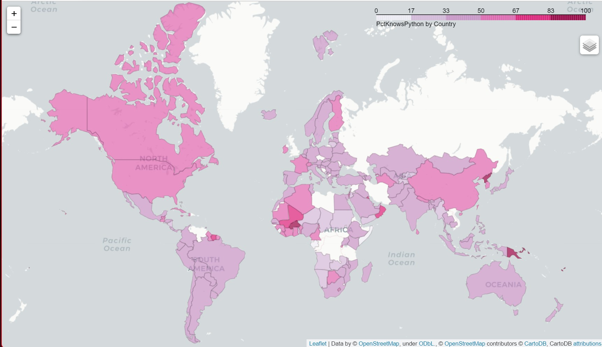

<h1 align="center">
  <br>
  Pandas-Demo
  <br>
</h1>

<h4 align="center">Quick EDA and insights using 2022 Stack Overflow survey data to demonstrate some Python fundamentals.

<p align="center">
  <a href="#key-features">Key Features</a> •
  <a href="data-source">Data Source</a> •
  <a href="#how-to-use">How To Use</a> •
  <a href="#credits">Credits</a> •
  <a href="#contact">Contact Me</a>
</p>


<center></center>

## Key Features

* EDA of StackOverFlow Dev survey 2022 using pandas
* Quick analysis of pcts of respondents who work from home, know Python, etc.
* Geopandas & folium mapping of pct respondents who know Python by country
* Skills learned: venv, pd, gpd, git, git bash, github, markdown, html

## Data Source
Data for this analysis was obtained from the [2022 Stack Overflow Developer Survey](https://survey.stackoverflow.co/2022/). Main data is pulled from survey_results_public.csv which was too large to push to this repo. 

## How To Use

To clone and run this, you'll need [Git](https://git-scm.com) installed on your computer. From your command line:

```bash
# Clone this repository
$ git clone https://github.com/Obscureagain/pandas-demo

# Go into the repository
$ cd pandas-demo

# Install dependencies
$ pip install -r requirements.txt
```

## Credits

This project was successful largely due to learning from the following resources:

- [CS50P Intro to Programming with Python](https://cs50.harvard.edu/python/2022/)
- [YT - Corey Schafer](https://www.youtube.com/channel/UCCezIgC97PvUuR4_gbFUs5g)
- [YT - Keith Galli](https://www.youtube.com/channel/UCq6XkhO5SZ66N04IcPbqNcw)

## Contact

> GitHub [@Obscureagain](https://github.com/Obscureagain) &nbsp;&middot;&nbsp;
> LinkedIn [@asullivan22](https://www.linkedin.com/in/asullivan22/)